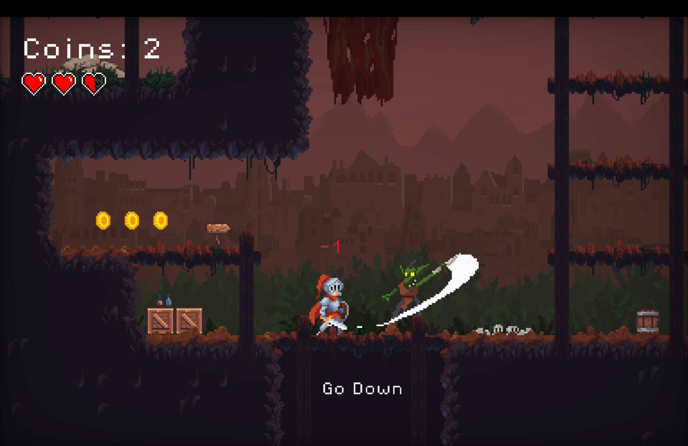
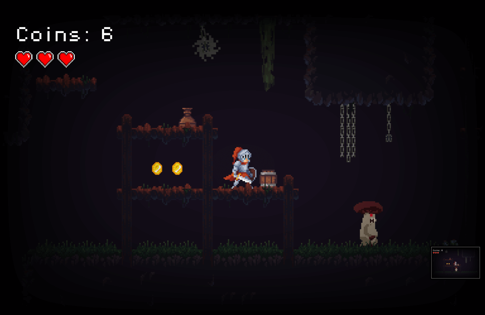
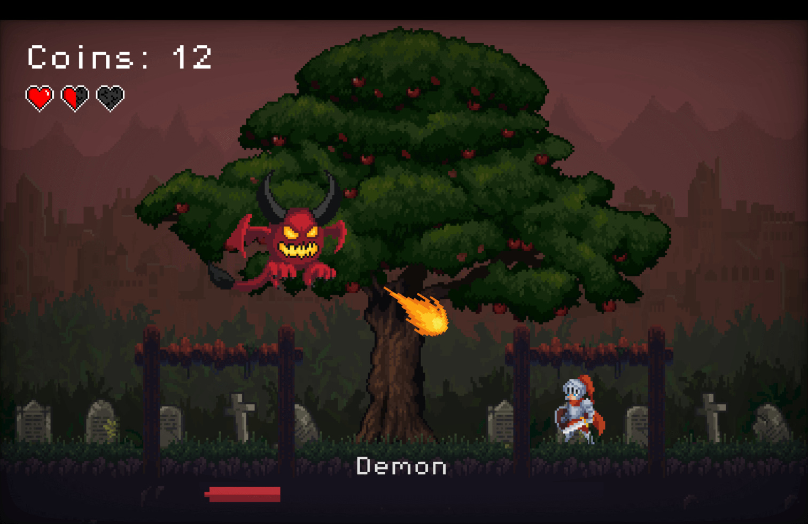

## Godot 4.3 Platformer Game

**Chrome, Firefox, Edge** ✅ **Safari** ⛔️

  
  
  

## [Run Game For Free on Itch.io](https://denis23x.itch.io/deepwood)

### Description 🕹️

Embark on an epic journey in this action-packed 2D platformer! Play as a brave knight, armed with a trusty sword and unyielding courage, as you traverse dense, mystical woods and treacherous, shadowy caves.

### Features ⭐️

- Classic 2D platformer gameplay with modern twists.
- Beautifully hand-drawn environments that bring the woods and caves to life.
- Engaging combat mechanics with upgradeable power ups.
- An epic boss fight with the demon, combining strategy and precision.

### About 👨🏻‍💻

I decided to try making a simple game and I got hooked, it's very exciting to set up all these traps and think through the game design.

> I’m a full-stack Node.js developer with a passion for game development. If you’re looking for a dedicated and creative developer to join your team, I’d love to connect!

Another pet project in my collection, a brief game that takes 3–5 minutes to complete, for development download this repository and open the project in Godot.

### Thanks 🙏

My good friend **Gennadiy Uvarov** for testing this game!

The game uses free assets from the following authors,
I thank them for the materials provided!

**2D Assets:**

- https://xzany.itch.io/
  - Knight 2D Pixel Art
  - Flying Demon 2D Pixel Art
- https://theflavare.itch.io/
  - Fantasy Swamp Forest
- https://luizmelo.itch.io/
  - Monsters Creatures Fantasy
- https://nyknck.itch.io/
  - Pixel Art Effect - FX052
  - Pixel Art Effect - FX062
- https://nikllamadev.itch.io/
  - Ultimate Pixel Art Pack
- https://incolgames.itch.io/
  - Dungeon Tile Set
- https://szadiart.itch.io/
  - PixelPlatformerSet1v
- https://dani-maccari.itch.io/
  - Platformer Items
- https://brackeysgames.itch.io/
  - Brackeys Platformer Bundle
- https://gandalfhardcore.itch.io/
  - GandalfHardcore FREE Platformer Assets
- https://karsiori.itch.io/
  - Pixel Art Spruce Tree Pack
- https://paperhatlizard.itch.io/
  - Cryo's Mini GUI

**SFX:**

- https://leohpaz.itch.io
  - RPG_Essentials_Free
  - Minifantasy Dungeon SFX 
- https://voicebosch.itch.io
  - DEATH SOUNDS (Male)
- https://tiptoptomcat.itch.io
  - 8Bit GB Songs Vol 2 MP3 (GB Studio)

**Shaders:**

- https://godotshaders.com/author/randomdam/
  - Color manipulator
- https://godotshaders.com/author/timesi/
  - Swap Color
- https://godotshaders.com/author/pend00/
  - God rays
- https://godotshaders.com/author/scimple/
  - Vignette Shader
