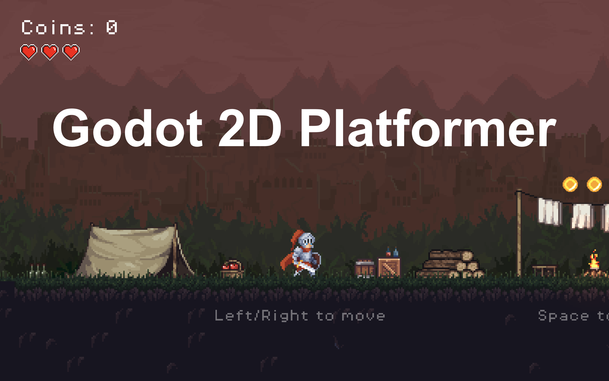

# Deepwood

## About

I decided to try making a simple game and I got hooked, it's very exciting to set up all these traps and think through the game design

Another pet project in my collection, a brief game that takes 3–5 minutes to complete, for development download this repository and open the project in Godot

## Used Free Assets

### 2D Assets:
- https://xzany.itch.io/
  - Knight 2D Pixel Art
- https://theflavare.itch.io/
  - Fantasy Swamp Forest
- https://luizmelo.itch.io/
  - Monsters Creatures Fantasy
- https://nyknck.itch.io
  - Pixel Art Effect - FX052
  - Pixel Art Effect - FX062
- https://nikllamadev.itch.io/
  - Ultimate Pixel Art Pack
- https://incolgames.itch.io/
  - Dungeon Tile Set
- https://szadiart.itch.io/
  - PixelPlatformerSet1v
- https://dani-maccari.itch.io/
  - Platformer Items
- https://brackeysgames.itch.io/
  - Brackeys Platformer Bundle
- https://gandalfhardcore.itch.io/
  - GandalfHardcore FREE Platformer Assets

### SFX:
- https://leohpaz.itch.io
  - RPG_Essentials_Free
  - Minifantasy Dungeon SFX 
- https://voicebosch.itch.io
  - DEATH SOUNDS (Male)

### Shaders
- https://godotshaders.com/author/ephnrora/
  - Pixel Art Style Shader
- https://godotshaders.com/author/literallywize/
  - Simple Sway
- https://godotshaders.com/author/randomdam/
  - Color manipulator
- https://godotshaders.com/author/exuin/
  - Palette Swap
